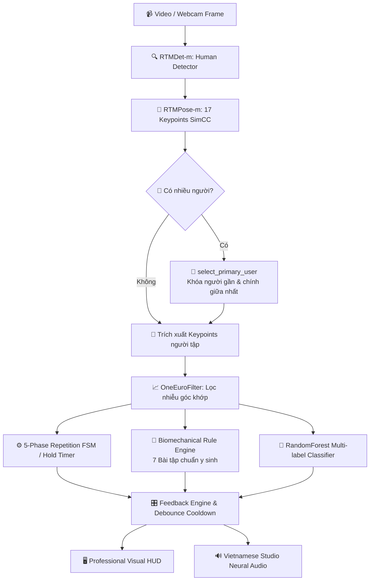

# 🧘 Pilates AI Pose Coach: Real-Time Posture Alignment & Kinematic Feedback

<div align="center">

[](https://www.python.org/)
[](https://onnxruntime.ai/)
[-FF6F00?style=for-the-badge&logo=openaccess&logoColor=white)](https://github.com/open-mmlab/mmpose)
[](https://github.com/open-mmlab/mmdetection)
[](https://scikit-learn.org/)
[](https://github.com/rany2/edge-tts)
[](LICENSE)

**Hệ thống AI thị giác máy tính hỗ trợ ước lượng khung xương, phân tích động học chuyển động, máy trạng thái FSM đếm Rep/bấm giờ, phân loại lỗi sai tư thế và hướng dẫn bằng giọng nói tiếng Việt thời gian thực.**

[Tính Năng Nổi Bật](#-tính-năng-nổi-bật) •
[Kiến Trúc Pipeline](#-kiến-trúc-hệ-thống--pipeline) •
[Giáo Án 7 Bài Tập](#-bộ-giáo-án-7-bài-tập-y-sinh-học) •
[Cài Đặt & Chạy](#-hướng-dẫn-cài-đặt--khởi-chạy-quick-start) •
[Phím Tắt Đổi Bài](#-phím-tắt-đổi-bài-trên-webcam-dynamic-hotkeys) •
[Cấu Trúc Thư Mục](#-cấu-trúc-dự-án) •
[Lộ Trình](#-kế-hoạch-phát-triển-roadmap)

</div>

---

## 📌 Giới thiệu dự án (Overview)

Tập luyện **Pilates** và **Fitness** đòi hỏi sự chuẩn xác cao về mặt **căn chỉnh tư thế (alignment)** và **độ ổn định vùng cơ lõi (core stability)**. Khác với tập gym thông thường (chủ yếu đếm rep tạ), việc tập sai tư thế trong Pilates (như võng thắt lưng, lệch hông, góc gối vượt quá tầm vận động an toàn) có thể gây chấn thương trực tiếp lên đĩa đệm cột sống và các khớp.

Dự án này xây dựng một trợ lý AI Huấn luyện viên thông minh ứng dụng Thị giác máy tính (Computer Vision) hoạt động trực tiếp qua Webcam máy tính hoặc video luồng thực:
- 🎯 **Ước lượng tư thế người (Human Pose Estimation)**: Độ chính xác cao ngay cả ở các tư thế nằm sàn (*Supine, Prone, Side-lying*) nhờ mô hình `RTMPose-m (SimCC)`.
- 📐 **Phân tích động học (Kinematics & Smoothing)**: Bộ lọc `OneEuroFilter` triệt tiêu rung giật dữ liệu góc khớp (Anti-jitter).
- ⏱️ **Máy trạng thái đếm Rep & Bấm giờ (5-Phase FSM & Hold Timer)**: Đếm số lần lặp chuẩn xác theo chu kỳ chuyển động và bấm giờ các bài giữ tĩnh (Isometric Hold).
- 🧠 **Đánh giá form kép (Rule-based & AI Multi-label)**: Kết hợp ngưỡng y sinh học (NSCA, McGill) và mô hình Machine Learning phân loại cùng lúc nhiều lỗi sai (Knee Valgus, Back Rounding, Insufficient Depth,...).
- 🎙️ **Huấn luyện viên ảo phát giọng nói tiếng Việt Studio**: Giọng đọc Neural Voice tự nhiên, cơ chế Debounce tránh spam âm thanh.
- 👥 **Tự động khóa người tập chính (Dominant User Auto-Lock)**: Tự động nhận diện và khóa vào người tập gần camera nhất khi khung hình có nhiều người.

---

## 🚀 Tính năng nổi bật (Key Features)

- ⚡ **Hiệu năng cao (>60 FPS trên CPU, >120 FPS trên GPU)**: Tối ưu hoá toàn diện bằng ONNX Runtime FP16/FP32.
- 🎯 **Độ chính xác Sub-pixel (SimCC Paradigm)**: Triệt tiêu hiện tượng rung giật khung xương khi giữ các tư thế tĩnh (*Isometric Hold* như *Plank, Hundred, Bird Dog*).
- 🔄 **Máy trạng thái 5 pha (5-Phase Repetition FSM)**: `START` $\rightarrow$ `DESCENDING` $\rightarrow$ `BOTTOM` $\rightarrow$ `ASCENDING` $\rightarrow$ `COMPLETED` kết hợp chống dội tín hiệu (Hysteresis) và kiểm soát thời gian tối thiểu một Rep ($\ge 1.0s$).
- 🗣️ **Phản hồi âm thanh tiếng Việt tự nhiên**: Chạy đa luồng ngầm (Asynchronous Daemon Thread) qua `pygame.mixer`, không làm giật lag hình ảnh camera.
- 🎛️ **Chuyển đổi bài tập tức thời (Dynamic Hotkeys)**: Bấm phím số `1`-`7` trên bàn phím để đổi bài ngay trên màn hình camera mà không cần khởi động lại.
- 🛡️ **Kiểm soát tầm nhìn toàn thân (Gatekeeper)**: Tự động nhắc nhở người dùng lùi ra xa nếu camera chỉ thấy nửa thân trên.

---

## 🧠 Kiến trúc hệ thống & Pipeline



---

## 🏋️ Bộ giáo án 7 bài tập y sinh học

Hệ thống được lập trình sẵn các bộ quy tắc động học và phân tích tư thế cho 7 bài tập thể dục & Pilates:

| Bài tập | Phân loại | Tiêu chuẩn đo lường động học | Lỗi sai phát hiện |
| :--- | :--- | :--- | :--- |
| **1. Squat** | Repetition | Góc gối hạ $\le 90^\circ$, góc thân lưng $\ge 45^\circ$ | Chưa đủ độ sâu, chụm đầu gối (Valgus), gập lưng quá mức |
| **2. Forward Lunge** | Repetition | Chân bước trước gập $90^\circ$, gối sau hạ sát sàn | Bước quá ngắn, thân người đổ ngả |
| **3. Glute Bridge** | Repetition | Thẳng hàng 3 điểm: Gối - Hông - Vai ($180^\circ$) | Hông nâng chưa đủ cao |
| **4. Forearm Plank** | Isometric Hold | Bấm giờ giữ thẳng lưng ($165^\circ - 180^\circ$) | Xệ thắt lưng (Võng lưng), chổng mông quá cao |
| **5. Pilates Hundred** | Isometric Hold | Nâng chân góc $45^\circ$, cuộn vai nâng ngực khỏi thảm | Hạ chân quá thấp hoặc co gối |
| **6. Bird Dog** | Repetition | Tay và chân đối bên duỗi thẳng song song sàn | Lưng võng, tay/chân chưa duỗi ngang thân |
| **7. Side Leg Raise** | Repetition | Biên độ mở khớp háng $35^\circ - 45^\circ$ | Nâng chân chưa đủ biên độ, xoay vặn hông |

---

## 🛠️ Hướng dẫn cài đặt & Khởi chạy (Quick Start)

### 1. Clone repository và chuẩn bị môi trường

```bash
git clone https://github.com/dothang13/pilates-ai-pose-coach.git
cd pilates-ai-pose-coach

# Khởi tạo môi trường ảo Python 3.9 - 3.11 (Khuyến nghị)
python -m venv venv
.\venv\Scripts\activate       # Trên Windows
# source venv/bin/activate    # Trên Linux / macOS

# Cài đặt thư viện phụ thuộc
pip install -r requirements.txt
```

### 2. Khởi chạy Huấn luyện viên AI trực tiếp (Webcam)

Chạy ứng dụng tích hợp đầy đủ với Webcam máy tính:

```bash
# Chạy mặc định bài Squat qua Webcam:
python main_ai_coach.py --exercise squat --source 0

# Chạy với bài tập khác (ví dụ: Plank hoặc Glute Bridge):
python main_ai_coach.py --exercise plank --source 0
python main_ai_coach.py --exercise glute_bridge --source 0

# Chạy với file video bài tập có sẵn:
python main_ai_coach.py --exercise squat --source data/raw/squat_test.mp4
```

---

## ⌨️ Phím tắt đổi bài trên Webcam (Dynamic Hotkeys)

Khi cửa sổ camera đang mở, bạn có thể bấm trực tiếp các phím sau trên bàn phím để **chuyển bài tập tức thì**:

* Bấm **`1`**: Bài **Squat**
* Bấm **`2`**: Bài **Forward Lunge**
* Bấm **`3`**: Bài **Glute Bridge**
* Bấm **`4`**: Bài **Forearm Plank**
* Bấm **`5`**: Bài **Pilates Hundred**
* Bấm **`6`**: Bài **Bird Dog**
* Bấm **`7`**: Bài **Side Leg Raise**
* Bấm **`q`**: Thoát chương trình

*(Mỗi lần bấm phím, AI sẽ lập tức phát âm thanh xác nhận bằng tiếng Việt và chuyển thanh đo HUD tương ứng).*

---

## 🧪 Các script kiểm thử độc lập (Testing Scripts)

Bạn có thể chạy thử từng module con độc lập trong thư mục `core_coach/`:

```bash
# 1. Nghe thử giọng nói tiếng Việt Studio qua loa máy tính:
python core_coach/test_audio.py

# 2. Chạy mô phỏng kiểm thử toàn bộ Pipeline đếm Rep + Lọc rung + Giọng nói:
python core_coach/test_mock_coach.py

# 3. Huấn luyện mô hình AI Multi-label phân loại lỗi tư thế:
python core_coach/train_model.py
```

---

## 📂 Cấu trúc dự án (Project Structure)

```text
pilates-ai-pose-coach/
│
├── .gitignore                   # Cấu hình loại trừ file nháp, checkpoints lớn
├── LICENSE                      # Giấy phép mã nguồn mở MIT
├── README.md                    # Tài liệu tổng quan & hướng dẫn toàn diện
├── requirements.txt             # Danh sách thư viện phụ thuộc
├── main_ai_coach.py             # Ứng dụng chính tích hợp trọn vẹn (Pose + Coach)
├── test_rtmpose_m.py            # Mã nguồn kiểm thử trích xuất 2D Pose gốc
│
├── core_coach/                  # 📦 Package AI Coach & Xử lý động học
│   ├── __init__.py
│   ├── smoothing.py             # Bộ lọc OneEuroFilter & MovingAverage
│   ├── fsm_counter.py           # Máy trạng thái 5 pha đếm Rep & Hold Timer
│   ├── exercise_rules.py        # Quy tắc góc y sinh học cho 7 bài tập
│   ├── audio_speaker.py         # Trình phát giọng nói Neural Voice tiếng Việt
│   ├── feedback_engine.py       # Bộ điều khiển phản hồi HUD & Debounce Cooldown
│   ├── train_model.py           # Script huấn luyện mô hình AI Multi-label
│   ├── error_classifier.py      # Module suy luận phân loại lỗi thời gian thực
│   ├── generate_audio_cues.py   # Script tạo kho âm thanh Studio tiếng Việt
│   ├── test_audio.py            # Test kiểm tra phát âm thanh
│   ├── test_mock_coach.py       # Test mô phỏng toàn diện pipeline
│   └── audio_cache/             # Kho file âm thanh giọng đọc tiếng Việt (.mp3)
│
└── data/                        # Quản lý dữ liệu mẫu
    ├── raw/                     # Video bài tập thô
    └── processed/               # File trích xuất đặc trưng (.csv / .json)
```

---

## 🗓️ Kế hoạch phát triển (Roadmap)

- [x] **Giai đoạn 1**: Xây dựng Baseline 2D Pose Estimation với RTMPose-m qua ONNX Runtime.
- [x] **Giai đoạn 2**: Tích hợp module tính toán góc động học và bộ lọc khử nhiễu OneEuroFilter.
- [x] **Giai đoạn 3**: Xây dựng máy trạng thái hữu hạn (5-Phase FSM) đếm Rep và Hold Timer bấm giờ chuẩn xác.
- [x] **Giai đoạn 4**: Xây dựng bộ luật động học 7 bài tập kết hợp mô hình AI Multi-label phân loại lỗi tư thế.
- [x] **Giai đoạn 5**: Tích hợp động cơ hướng dẫn bằng giọng nói tiếng Việt tự nhiên và giao diện HUD thời gian thực.
- [x] **Giai đoạn 6**: Cài đặt thuật toán Dominant User Auto-Lock chống nhiễu khi có nhiều người trong camera.
- [ ] **Giai đoạn 7**: Nâng cấp module nâng tọa độ 2D lên 3D (3D Lifting) để bắt các chuyển động xoay ngoài mặt phẳng camera.
- [ ] **Giai đoạn 8**: Đóng gói hoàn chỉnh thành ứng dụng di động (On-device Edge AI Mobile App).

---

## 👥 Đóng góp & Bản quyền (License)

Dự án được phát hành dưới giấy phép mã nguồn mở [MIT License](LICENSE).
Mọi đóng góp, báo cáo lỗi (Issue) hoặc đề xuất tính năng (Pull Request) đều rất được hoan nghênh!
